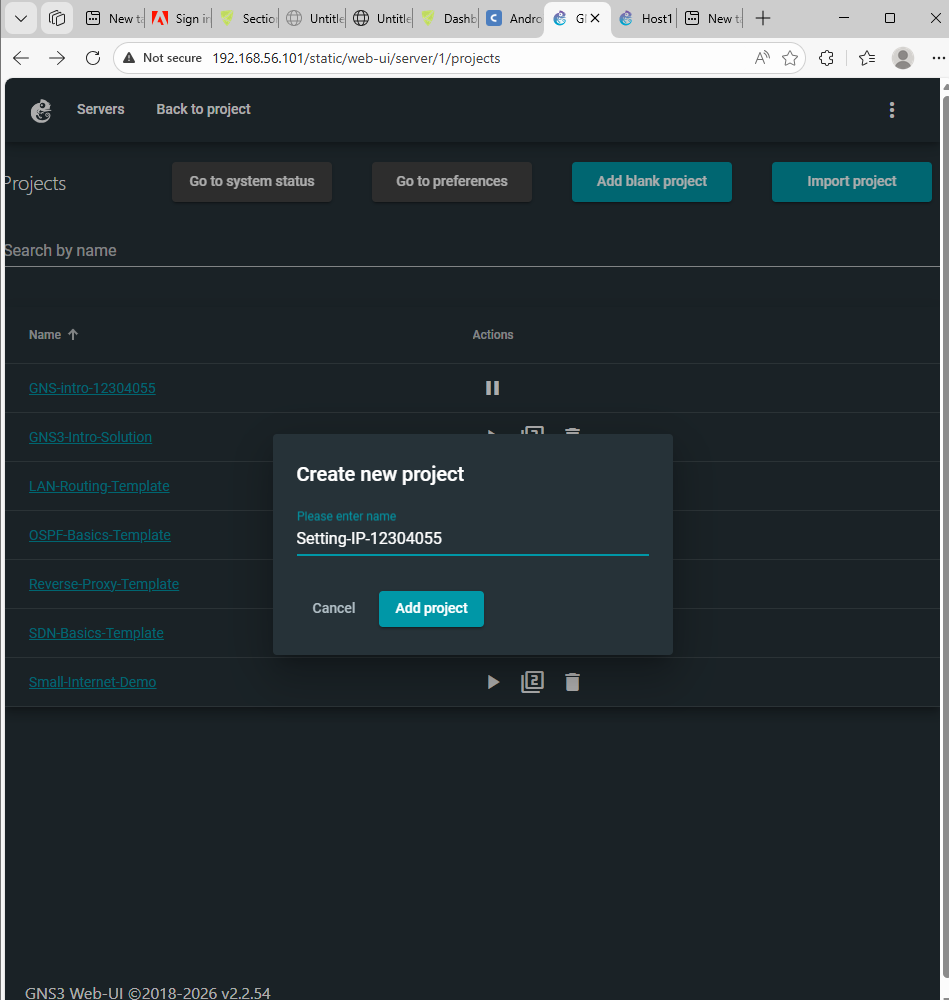
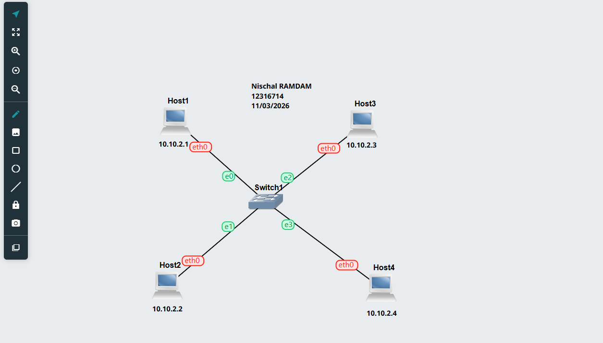
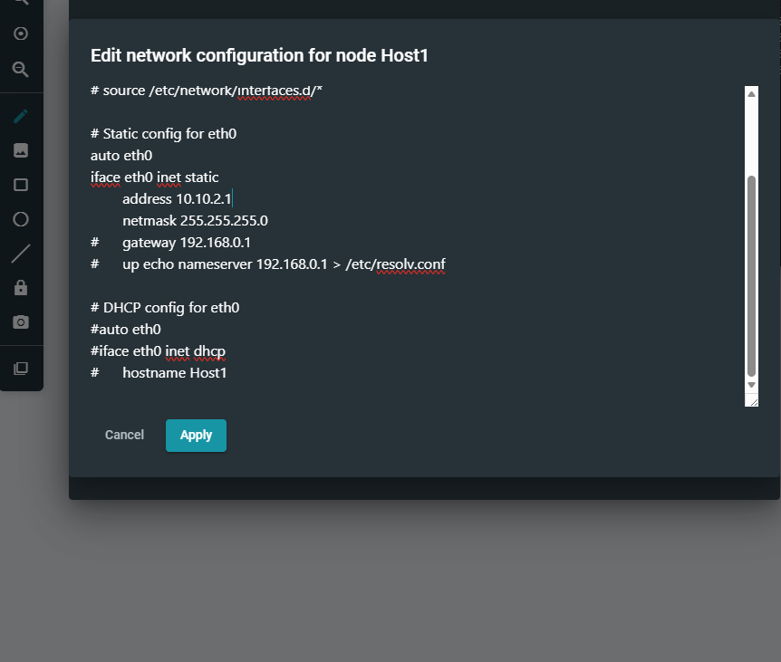
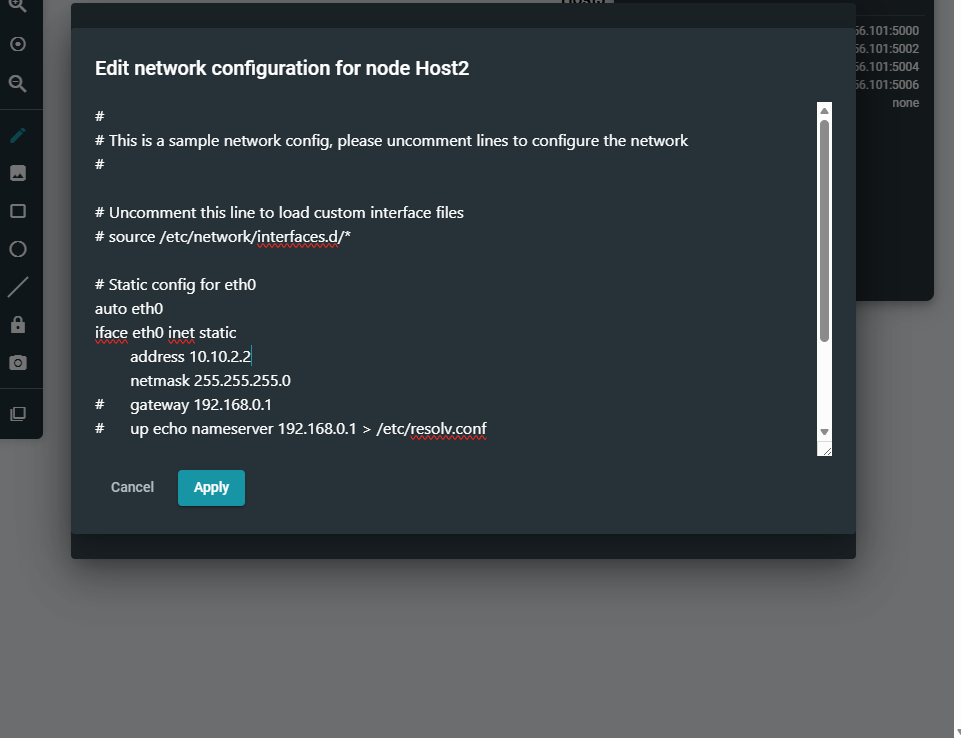
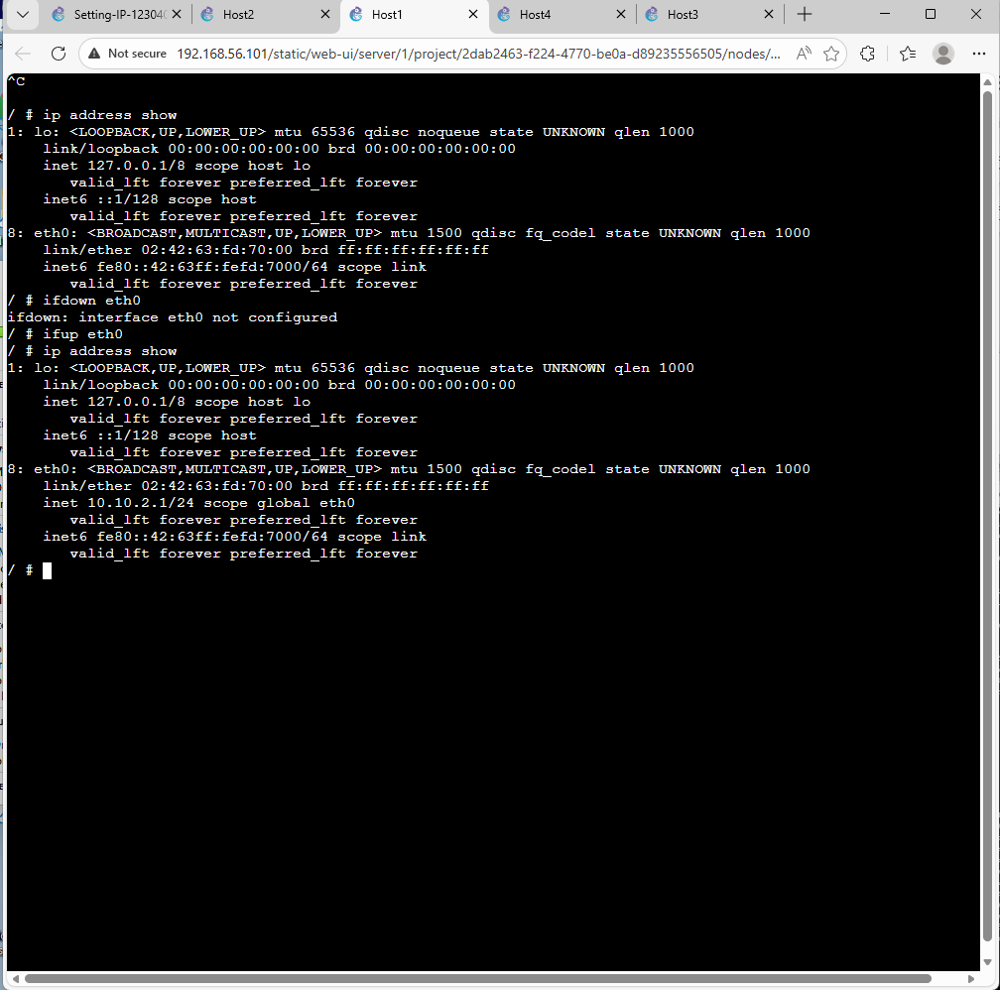
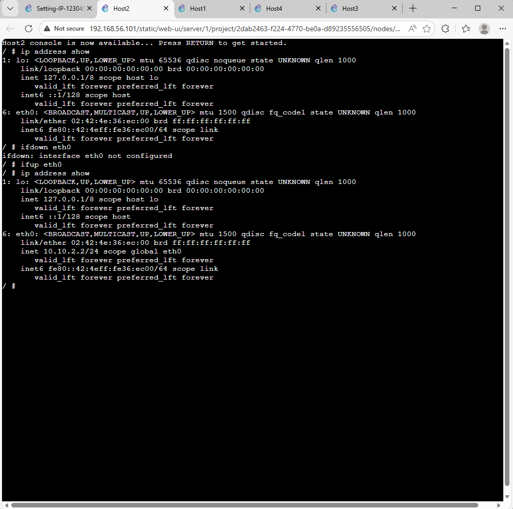
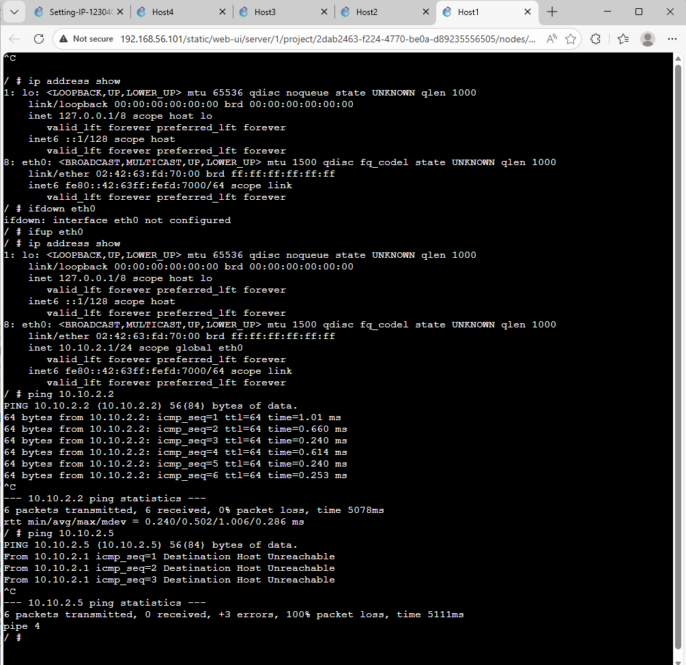

# TCP/IP Configuration - Week 1

## Student Details
- Name: Nischal Ramdam
- Student ID: 12316714
- Course: COIT12206
- Date: 11/03/2026

---

## Project Overview
This project demonstrates a basic TCP/IP configuration using GNS3. A single Linux host was added to the topology and configured with a static IP address. The configuration was verified through the console.

---

## Task Summary
- Created a new GNS3 project
- Added one Linux host
- Configured a static IP address for Host1
- Verified the configuration through the console
- Captured screenshots as evidence of completion

---

## Network Topology
- 1 Linux Host: Host1
- Standalone host topology for basic IP configuration practice

---

## IP Configuration
- IP Address: 10.10.1.1
- Subnet Mask: 255.255.255.0
- Gateway: 192.168.0.1
- DNS: 192.168.0.1

---

## Configuration Code

```bash
auto eth0
iface eth0 inet static
    address 10.10.1.1
    netmask 255.255.255.0
    gateway 192.168.0.1
    up echo nameserver 192.168.0.1 > /etc/resolv.conf
```

---

## Screenshots

### Project Creation



### Host Configuration




### Console Output




### Ping View




---

## Learning Outcome
This task helped me understand how to create a simple GNS3 project, assign a static IP address to a Linux host, and verify the network configuration using terminal commands.

---

## Author
**Nischal Ramdam**
