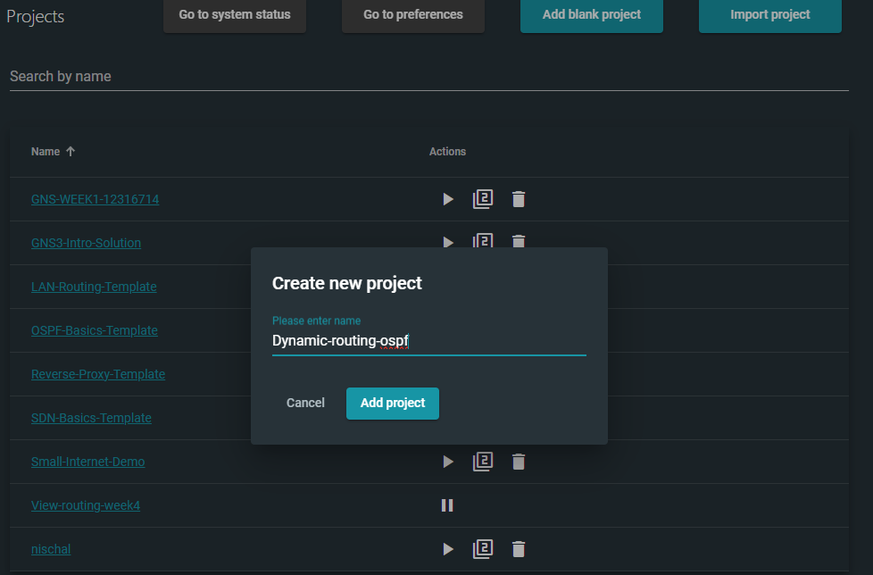
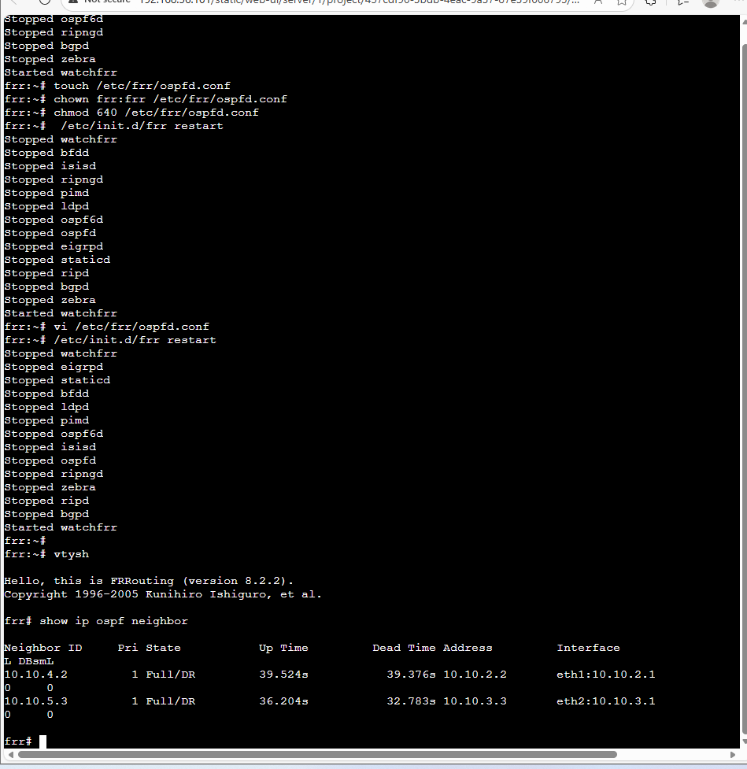
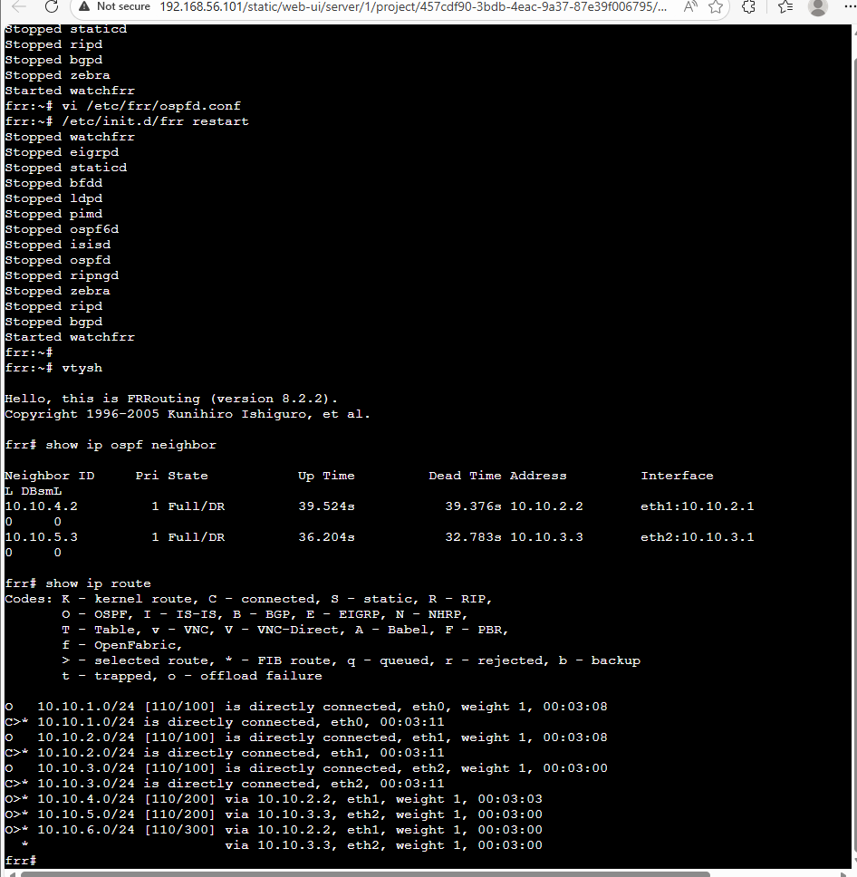
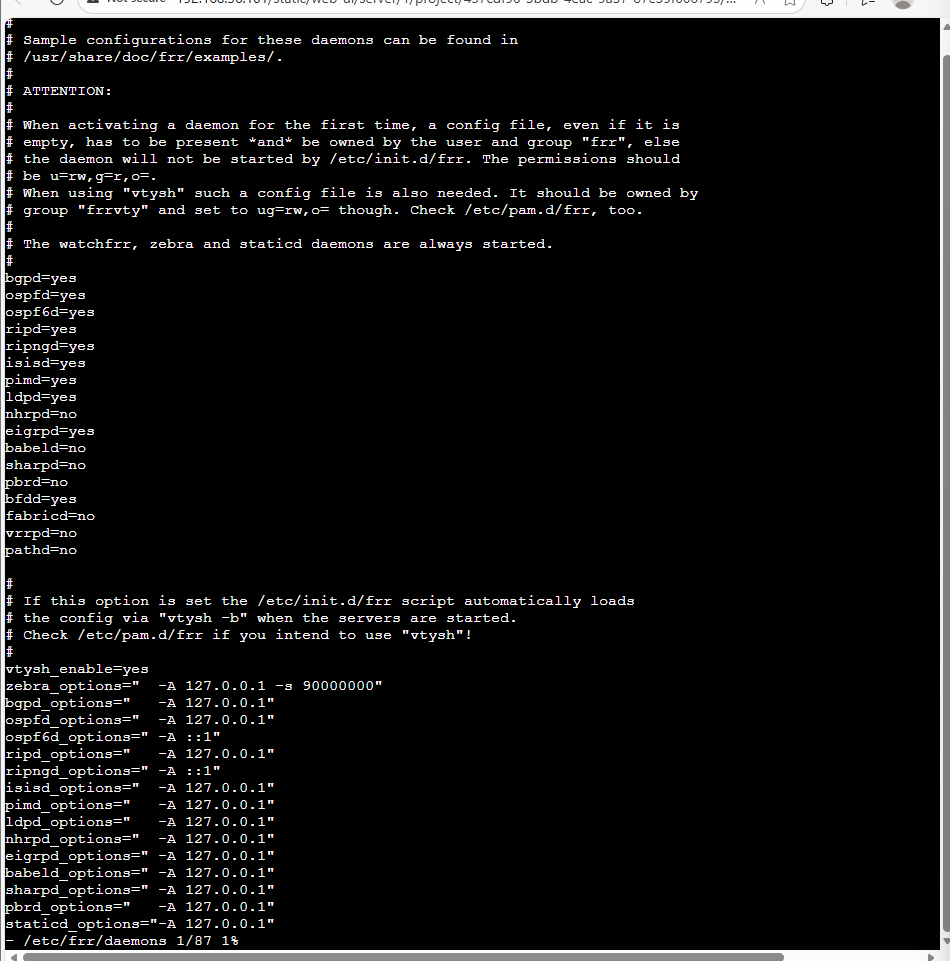
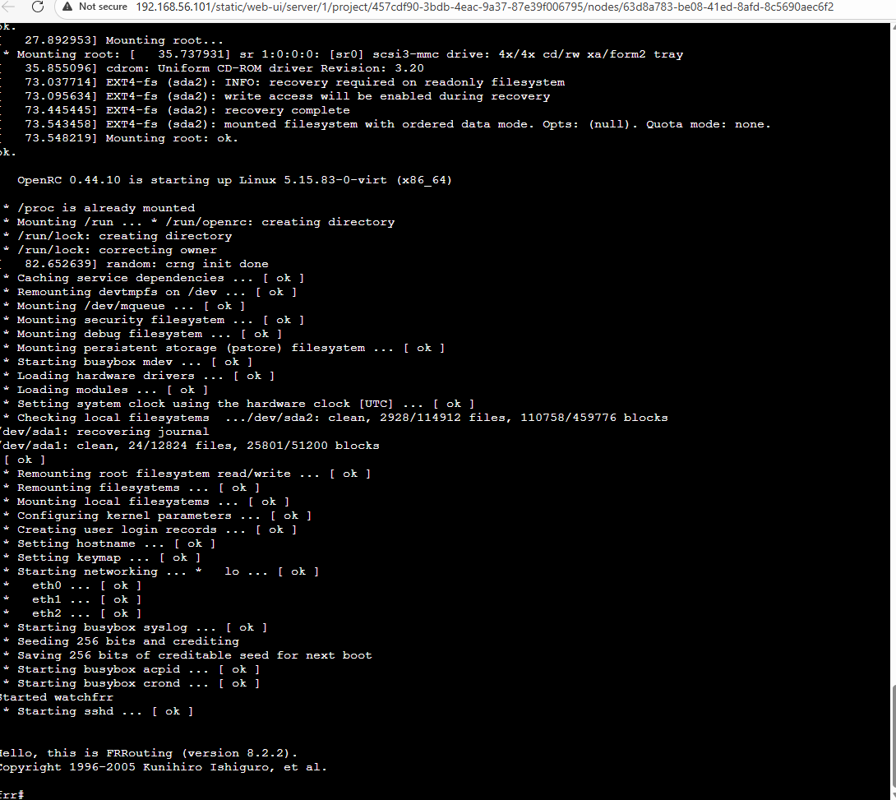
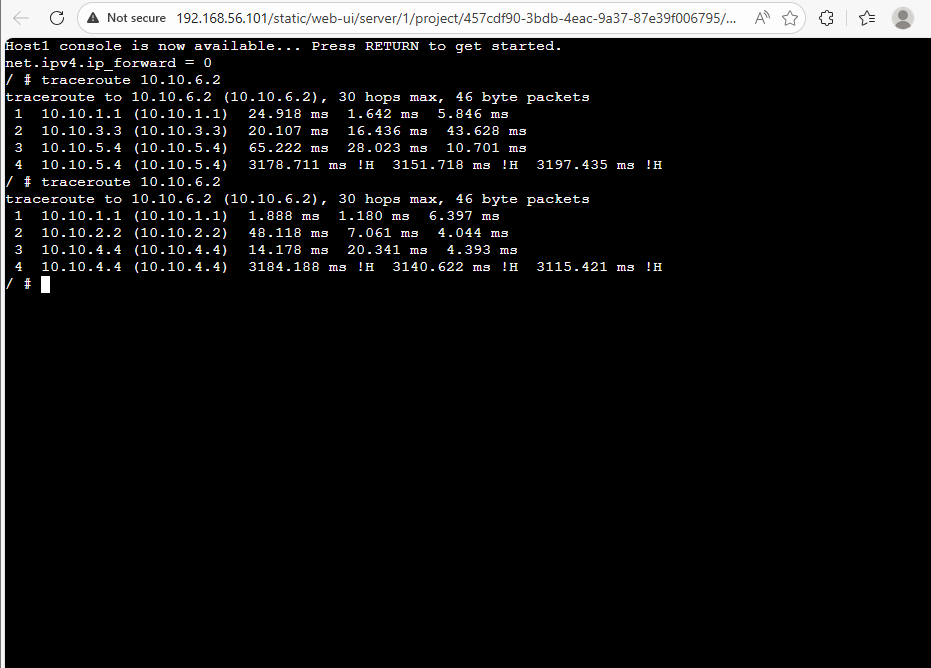

# COIT12206 – Week 01 Portfolio

##  Student Details

* Name: Nischal Ramdam
* Student ID: 12316714
* Date: 01/04/2026

---

##  Network Setup

* Host1 & Host2 → Switch → Router → Host3

---

##  Configuration

```bash
# Host1
auto eth0
iface eth0 inet static
    address 10.1.1.11
    netmask 255.255.255.0
    gateway 10.1.1.1

# Host2
auto eth0
iface eth0 inet static
    address 10.1.1.12
    netmask 255.255.255.0
    gateway 10.1.1.1

# Host3
auto eth0
iface eth0 inet static
    address 10.1.2.11
    netmask 255.255.255.0
    gateway 10.1.2.1

# Router
auto eth0
iface eth0 inet static
    address 10.1.1.1
    netmask 255.255.255.0

auto eth1
iface eth1 inet static
    address 10.1.2.1
    netmask 255.255.255.0

# Enable routing
up sysctl net.ipv4.ip_forward=1
```

---

##  Commands

```bash
ip address show
ping 10.1.1.11
ping 10.1.2.11
```

---

##  Screenshots


# Task 2 – Dynamic Routing with OSPF

## Objective

This task demonstrates how Open Shortest Path First (OSPF) dynamically shares routing information between FRRouting (FRR) routers. It also shows how network paths automatically change when a link failure occurs, without requiring manual reconfiguration.

---

## OSPF Topology

The topology consists of:

* Host1 in network `10.10.1.0/24`
* Host2 in network `10.10.6.0/24`
* Four routers: FRR1, FRR2, FRR3, and FRR4
* Two alternative paths between the source and destination
* NETem nodes used to simulate network failure




---

## Configuration Used

### Enable OSPF in FRR

```
vtysh
configure terminal
router ospf
 network 10.10.0.0/16 area 0
exit
```

### Passive Interface Configuration

```
router ospf
 passive-interface eth0
```

### Save Configuration

```
write memory
```

---

## OSPF Verification

### OSPF Neighbor Output

This confirms that FRR1 successfully formed OSPF neighbor relationships with adjacent routers.



---

### IP Route Table

The routing table shows dynamically learned routes (marked with “O”), confirming that OSPF is functioning correctly.



---

## Traceroute Before Link Failure

Before disconnecting any link, traffic from Host1 to Host2 followed the shortest available path.




---

## Traceroute After Link Failure

After stopping the NETem node, the original path became unavailable. OSPF automatically recalculated the route and redirected traffic through the alternate path.



---

## Routing Summary Table

| Router | Destination Network | Next Node / Interface                            |
| ------ | ------------------- | ------------------------------------------------ |
| FRR1   | 10.10.1.0/24        | directly connected (eth0)                        |
| FRR1   | 10.10.2.0/24        | directly connected (eth1)                        |
| FRR1   | 10.10.3.0/24        | directly connected (eth2)                        |
| FRR1   | 10.10.4.0/24        | via 10.10.2.2                                    |
| FRR1   | 10.10.5.0/24        | via 10.10.3.3                                    |
| FRR1   | 10.10.6.0/24        | via 10.10.2.2 or 10.10.3.3 depending on topology |

---

## Key Observations

* OSPF propagated routes information between routers.
* Adjacency was formed.
* Routes with an "O" next them indicate OSPF routes.
* OSPF automatically recomputed the best path after a link failure.
* There was no need to reconfigure after the failure.
---

## Explanation

OSPF is a dynamic link-state routing protocol. Routers exchange information with each other and determine the best path based on cost.

Using the **passive-interface** command prevents OSPF updates from being sent to host subnets, enhancing efficiency and security.

The simulated link failure using NETem was detected by OSPF, which recalculated the routing table and re-routed the traffic via the alternate path.
---

## Conclusion

This task successfully demonstrated:

* Setting up and running OSPF dynamic routing
* Formation of OSPF adjacencies
* Dynamic learning of routes
* Adaptability to network changes and path re-calculation

The findings demonstrate that OSPF is very effective in providing network connectivity in dynamic environments.
