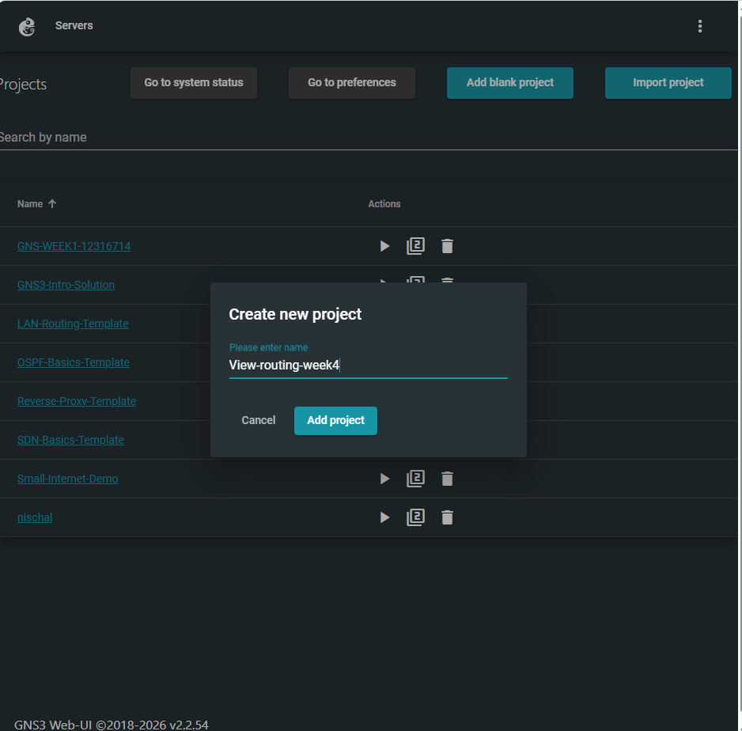
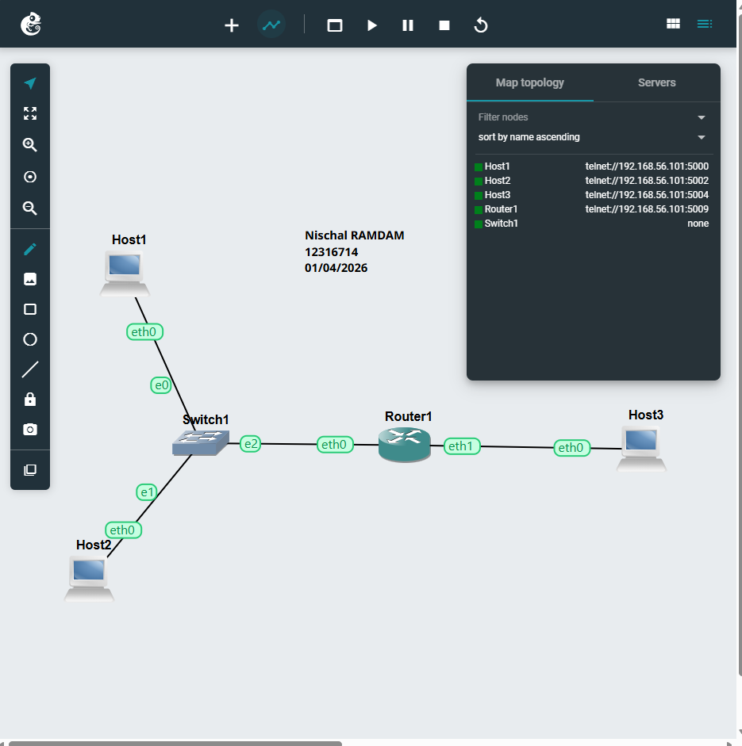
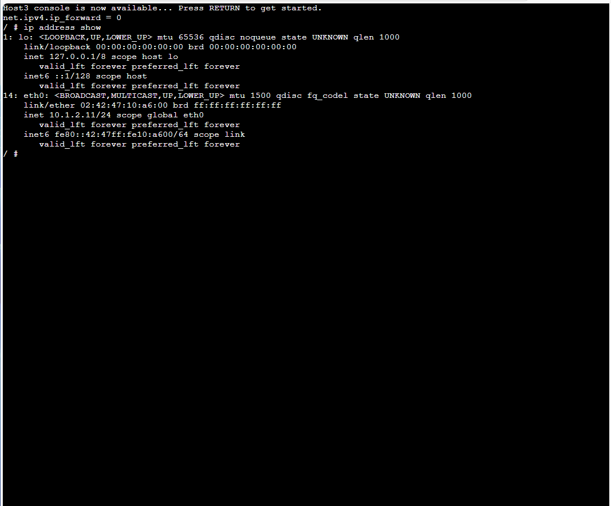
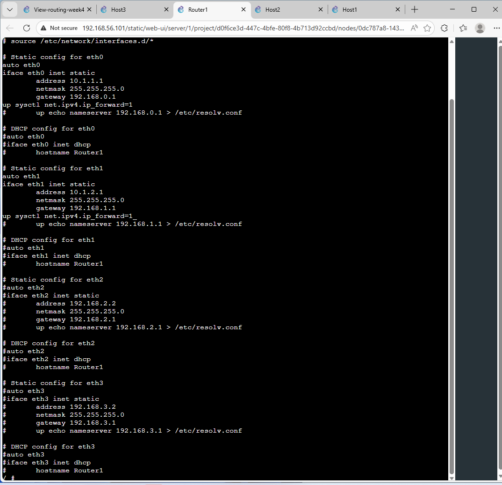
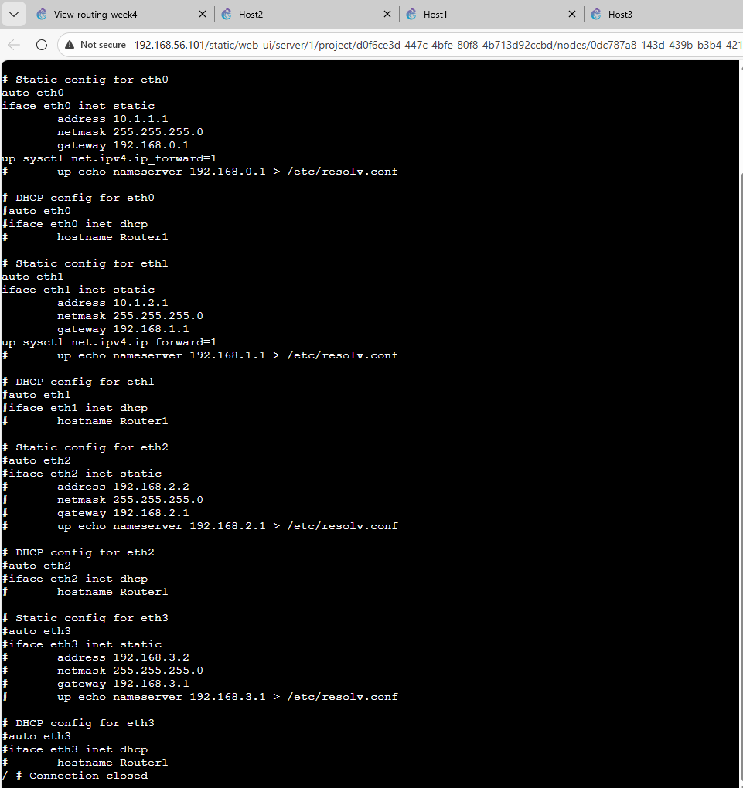
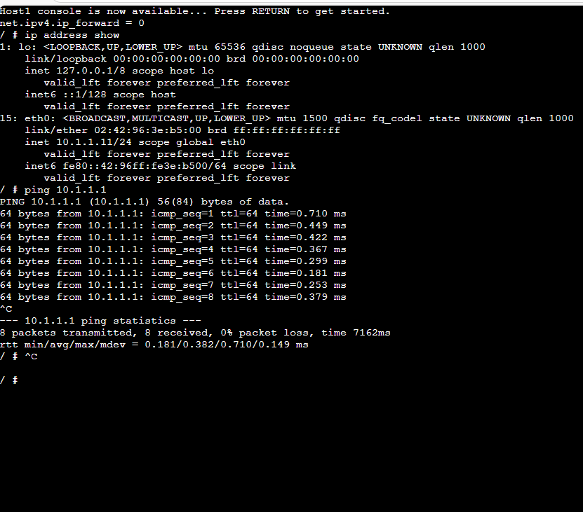
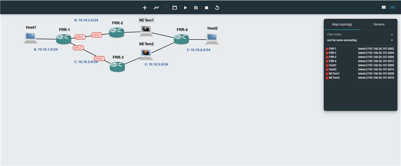

# COIT12206 – Week 01 Portfolio

##  Student Details

* Name: Nischal Ramdam
* Student ID: 12316714
* Date: 01/04/2026

---

##  Network Setup

* Host1 & Host2 → Switch → Router → Host3

---

##  Configuration

```bash
# Host1
auto eth0
iface eth0 inet static
    address 10.1.1.11
    netmask 255.255.255.0
    gateway 10.1.1.1

# Host2
auto eth0
iface eth0 inet static
    address 10.1.1.12
    netmask 255.255.255.0
    gateway 10.1.1.1

# Host3
auto eth0
iface eth0 inet static
    address 10.1.2.11
    netmask 255.255.255.0
    gateway 10.1.2.1

# Router
auto eth0
iface eth0 inet static
    address 10.1.1.1
    netmask 255.255.255.0

auto eth1
iface eth1 inet static
    address 10.1.2.1
    netmask 255.255.255.0

# Enable routing
up sysctl net.ipv4.ip_forward=1
```

---

##  Commands

```bash
ip address show
ping 10.1.1.11
ping 10.1.2.11
```

---

##  Screenshots













# Task 2 – Dynamic Routing with OSPF

## Objective

This task demonstrates how Open Shortest Path First (OSPF) dynamically shares routing information between FRRouting (FRR) routers. It also shows how network paths automatically change when a link failure occurs, without requiring manual reconfiguration.

---

## OSPF Topology

The topology consists of:

* Host1 in network `10.10.1.0/24`
* Host2 in network `10.10.6.0/24`
* Four routers: FRR1, FRR2, FRR3, and FRR4
* Two alternative paths between the source and destination
* NETem nodes used to simulate network failure




---

## Configuration Used

### Enable OSPF in FRR

```
vtysh
configure terminal
router ospf
 network 10.10.0.0/16 area 0
exit
```

### Passive Interface Configuration

```
router ospf
 passive-interface eth0
```

### Save Configuration

```
write memory
```

---

## OSPF Verification

### OSPF Neighbor Output

This confirms that FRR1 successfully formed OSPF neighbor relationships with adjacent routers.


---

### IP Route Table

The routing table shows dynamically learned routes (marked with “O”), confirming that OSPF is functioning correctly.


---

## Traceroute Before Link Failure

Before disconnecting any link, traffic from Host1 to Host2 followed the shortest available path.


---

## Traceroute After Link Failure

After stopping the NETem node, the original path became unavailable. OSPF automatically recalculated the route and redirected traffic through the alternate path.


---

## Routing Summary Table

| Router | Destination Network | Next Node / Interface                            |
| ------ | ------------------- | ------------------------------------------------ |
| FRR1   | 10.10.1.0/24        | directly connected (eth0)                        |
| FRR1   | 10.10.2.0/24        | directly connected (eth1)                        |
| FRR1   | 10.10.3.0/24        | directly connected (eth2)                        |
| FRR1   | 10.10.4.0/24        | via 10.10.2.2                                    |
| FRR1   | 10.10.5.0/24        | via 10.10.3.3                                    |
| FRR1   | 10.10.6.0/24        | via 10.10.2.2 or 10.10.3.3 depending on topology |

---

## Key Observations

* OSPF dynamically exchanged routing information between routers.
* Neighbor relationships were successfully established.
* Routes marked with “O” indicate OSPF-learned paths.
* When a link failure occurred, OSPF recalculated the best path automatically.
* No manual configuration was required after the failure.

---

## Explanation

OSPF is a dynamic routing protocol that uses link-state information to determine the best path between networks. Each router shares its routing information with neighbors and calculates the shortest path using cost metrics.

The use of **passive-interface** ensures that OSPF updates are not sent to host networks, improving efficiency and security.

When the link failure was simulated using NETem, OSPF detected the topology change and recomputed the routing table, allowing traffic to continue through an alternate path.

---

## Conclusion

This task successfully demonstrated:

* Configuration and operation of OSPF dynamic routing
* Establishment of OSPF neighbor relationships
* Automatic route learning and updating
* Network resilience through dynamic path recalculation

The results confirm that OSPF is highly efficient in maintaining connectivity in changing network conditions.

