# VLAN Configuration and Inter-VLAN Routing using GNS3

## Course

COIT12206 – TCP/IP Principles and Protocols

---

# Project Overview

This week 5 project explores how Virtual Local Area Networks (VLANs) can be used to segment a network and control communication between devices, where work is divided into two parts:

* **Task 1:** Configuring VLANs and verifying network isolation
* **Task 2:** Enabling communication between VLANs using a router

---

# Task 1: VLAN Configuration and Network Isolation

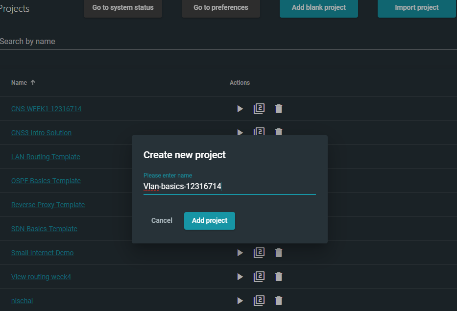

---

## Network Topology

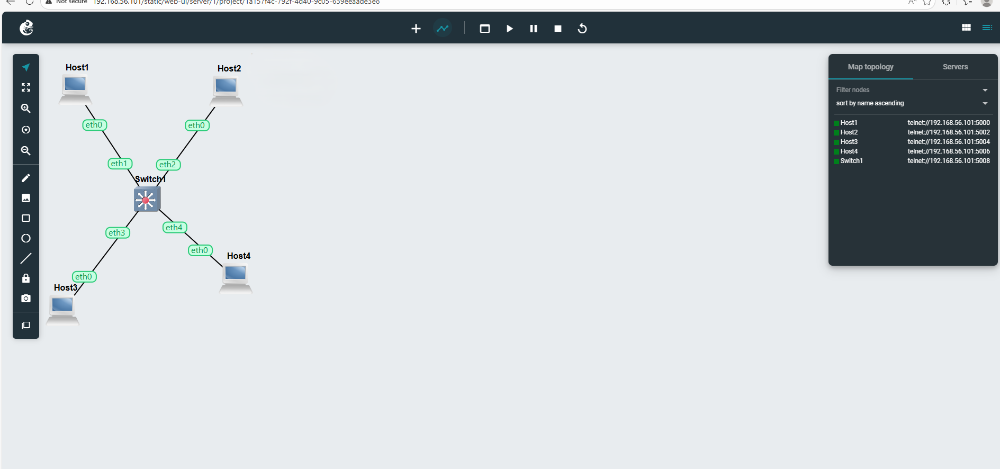

Topology setup, which includes four hosts connected to a single Open vSwitch used in task 1. At this stage, no router , which mean all communication depends entirely on VLAN configuration.

---

## Host Addressing

Each host 1 to 4 was manually assigned an IP address within the same subnet:

* Host1 : 10.10.1.101
* Host2 : 10.10.1.102
* Host3 : 10.10.1.103
* Host4 : 10.10.1.104


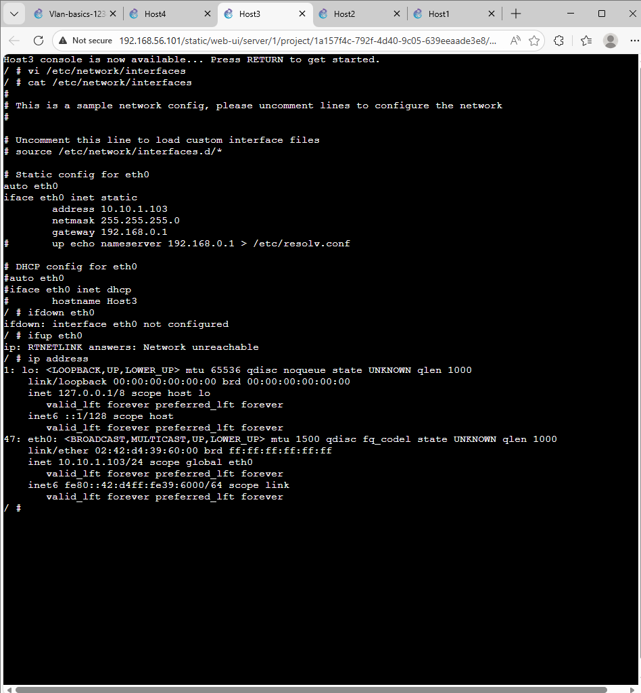
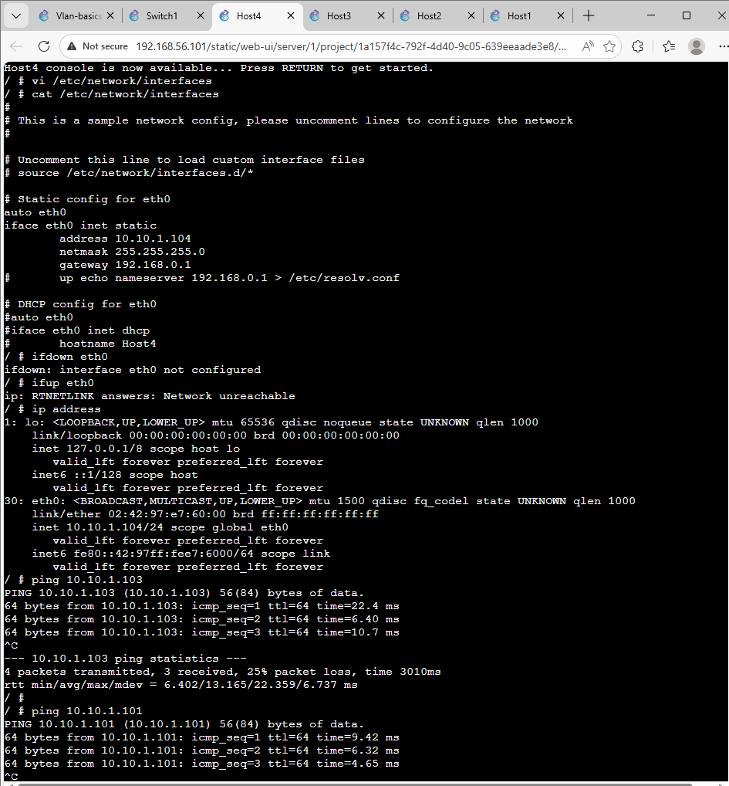

---

## VLAN Configuration

To logically divide the network, VLAN tagging was applied on the switch ports using Open vSwitch commands:

```
ovs-vsctl set port eth1 tag=10
ovs-vsctl set port eth2 tag=10
ovs-vsctl set port eth3 tag=20
ovs-vsctl set port eth4 tag=20
```

* VLAN 10 includes Host1 and Host2
* VLAN 20 includes Host3 and Host4

Configuration ensures that devices are grouped logically rather than physically.


---

## Switch Verification

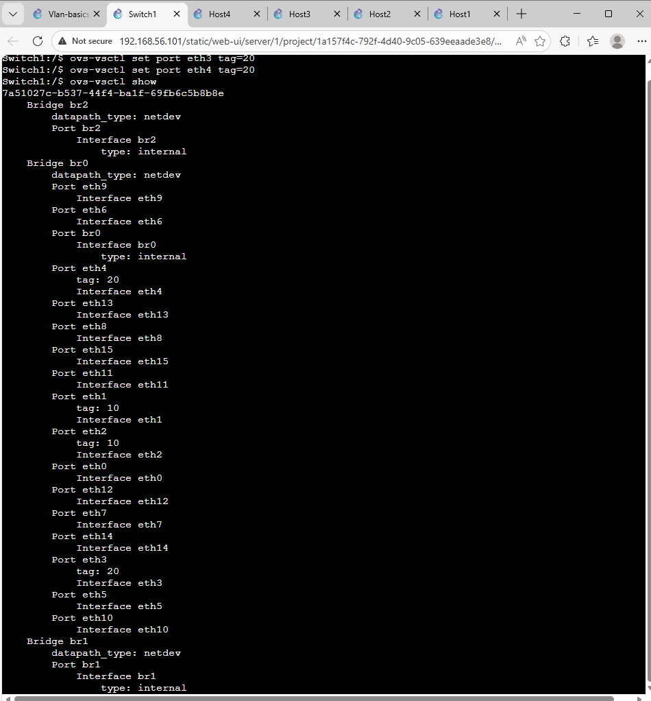


Switch screenshots confirm that VLAN tags have been successfully applied to the respective ports on the switch.

---

## Connectivity Testing


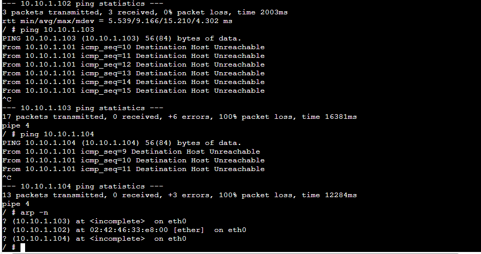

Ping testing was performed using the `ping` command to verify communication:

* Devices within the **same VLAN** were able to communicate successfully.
* Devices in **different VLANs** could not communicate.

This connectivity test that confirms VLAN segmentation is functioning as expected.

---

Address Resolution Protocol results further validated the isolation:

* Within the same VLAN, MAC addresses were resolved correctly
* Across VLANs, ARP requests failed, resulting in incomplete entries

This behaviour occurs because VLANs create separate broadcast domains, preventing ARP messages from crossing between them.

---

## Challenges Faced

During the implementation, several issues were encountered:

* Incorrect VLAN tagging initially caused unexpected connectivity
* Some ports were not properly assigned, leading to communication errors
* ARP results were confusing at first but became clear after understanding broadcast domain separation

These issues were resolved by carefully verifying switch configuration and rechecking port assignments.

---

## Explanation

VLANs work by dividing a single physical network into multiple logical networks. Each VLAN acts as an independent broadcast domain, meaning devices in one VLAN cannot directly communicate with devices in another VLAN without routing.

In this task, even though all hosts shared the same IP range, VLAN tagging ensured that traffic remained isolated. This demonstrates how VLANs enhance network security and organization without requiring additional hardware.

---

## Conclusion (Task 1)

The experiment successfully demonstrated VLAN-based network segmentation. Devices were grouped into separate logical networks, and communication was restricted accordingly.

This confirms that VLANs are an effective method for controlling traffic flow and improving network structure.

# Task 2: Inter-VLAN Routing

## Network Topology

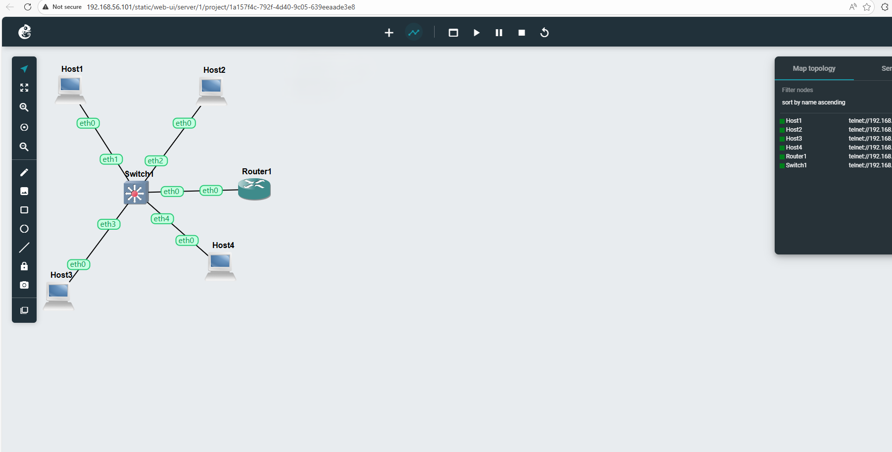

In this stage, a router is introduced into the network. The router is connected to the switch using a trunk link, allowing it to handle traffic from multiple VLANs.

---

## VLAN Configuration

The same VLAN grouping from Task 1 was maintained:

```id="9k1d2m"
ovs-vsctl set port eth1 tag=10
ovs-vsctl set port eth2 tag=10
ovs-vsctl set port eth3 tag=20
ovs-vsctl set port eth4 tag=20
```

* VLAN 10 → Host1 and Host2
* VLAN 20 → Host3 and Host4


---

## Trunk Port Configuration

To allow multiple VLANs to pass through a single link, the port connecting the switch to the router was configured as a trunk:

```id="t82hdk"
ovs-vsctl set port eth0 trunks=[]
```

This setup enables the router to receive and process traffic from all VLANs instead of being limited to just one.

---

## Router Configuration

The router was configured using VLAN sub-interfaces to handle traffic from different VLANs:

```id="x7sk2p"
ip link add link eth0 name eth0.10 type vlan id 10
ip link add link eth0 name eth0.20 type vlan id 20

ip addr add 10.10.1.1/24 dev eth0.10
ip addr add 10.10.2.1/24 dev eth0.20

ip link set eth0 up
ip link set eth0.10 up
ip link set eth0.20 up

echo 1 > /proc/sys/net/ipv4/ip_forward
```

Each sub-interface acts as a gateway for its respective VLAN:

* `eth0.10` → VLAN 10 gateway
* `eth0.20` → VLAN 20 gateway

Enabling IP forwarding allows the router to pass traffic between VLANs.

---

## IP Addressing

| Host  | IP Address  | VLAN |
| ----- | ----------- | ---- |
| Host1 | 10.10.1.101 | 10   |
| Host2 | 10.10.1.102 | 10   |
| Host3 | 10.10.2.103 | 20   |
| Host4 | 10.10.2.104 | 20   |

---

## Router Verification

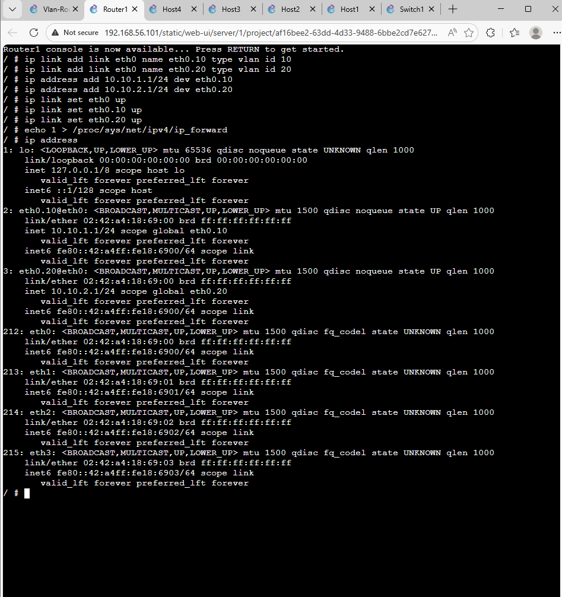

The output confirms that VLAN interfaces were successfully created and assigned IP addresses, acting as gateways for each network.

---

## Connectivity Testing

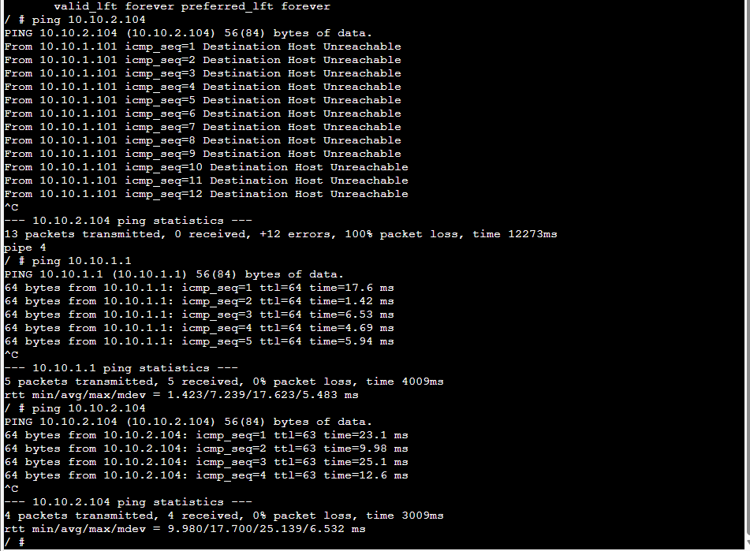

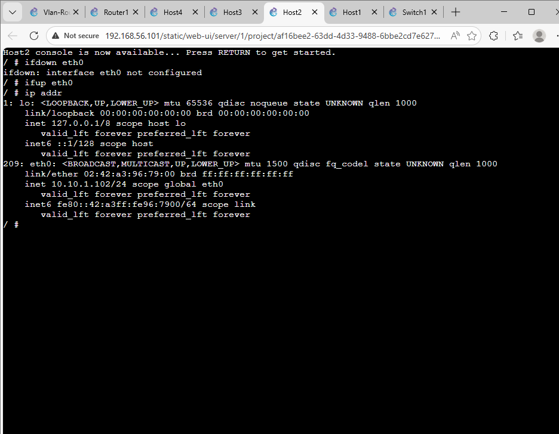
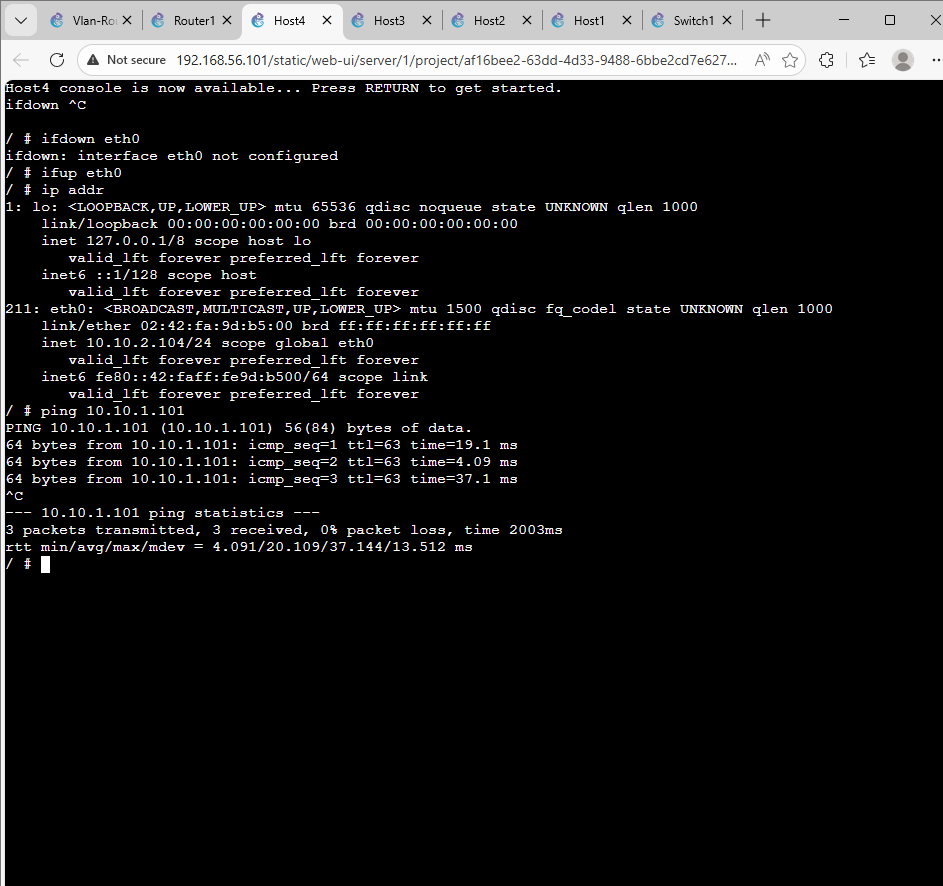

Testing showed the following results:

* Devices within the same VLAN continued to communicate normally
* Devices from different VLANs were now able to communicate through the router
* The router successfully forwarded packets between VLAN 10 and VLAN 20

---

---

# wireshark
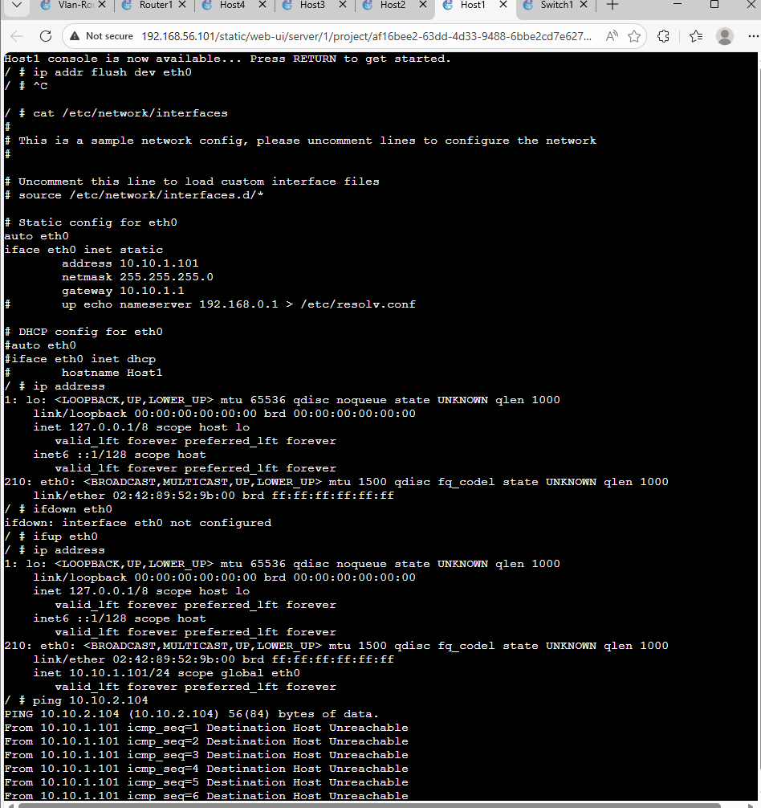

---

## Challenges Faced

During implementation, a few issues were encountered:

* Incorrect trunk configuration initially blocked VLAN traffic
* Sub-interfaces were not working until properly enabled
* Forgetting to enable IP forwarding caused routing failure

These problems were resolved by verifying configurations step-by-step and rechecking interface status.

---

## Explanation

Inter-VLAN routing is required when devices in different VLANs need to communicate. Since VLANs create separate broadcast domains, direct communication is not possible without a Layer 3 device.

In this setup, the router performs this role by using VLAN sub-interfaces. Each sub-interface is assigned to a VLAN and acts as its default gateway. When a device sends traffic to another VLAN, the packet is forwarded to the router, which then routes it to the correct destination network.

---

## Conclusion (Task 2)

This task successfully demonstrated how a router can be used to enable communication between isolated VLANs.

The results confirm that:

* VLANs remain logically separated
* The trunk link carries multiple VLANs efficiently
* The router enables controlled communication between networks

---

# Tools Used

* GNS3
* Open vSwitch
* Linux-based Router

---

# Final Summary

* VLANs were used to separate network traffic
* A trunk link allowed multiple VLANs to pass through a single connection
* The router enabled communication between VLANs
* The network operated successfully after proper configuration


