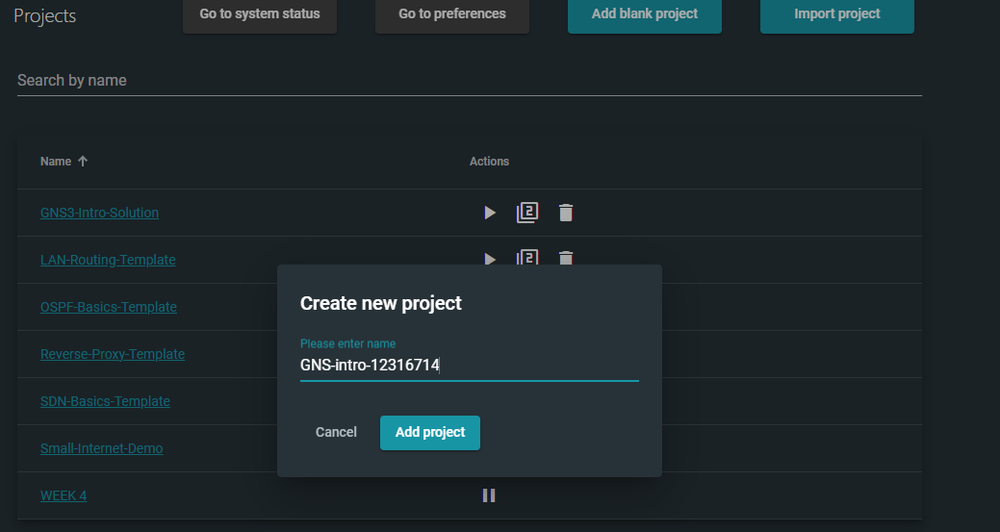
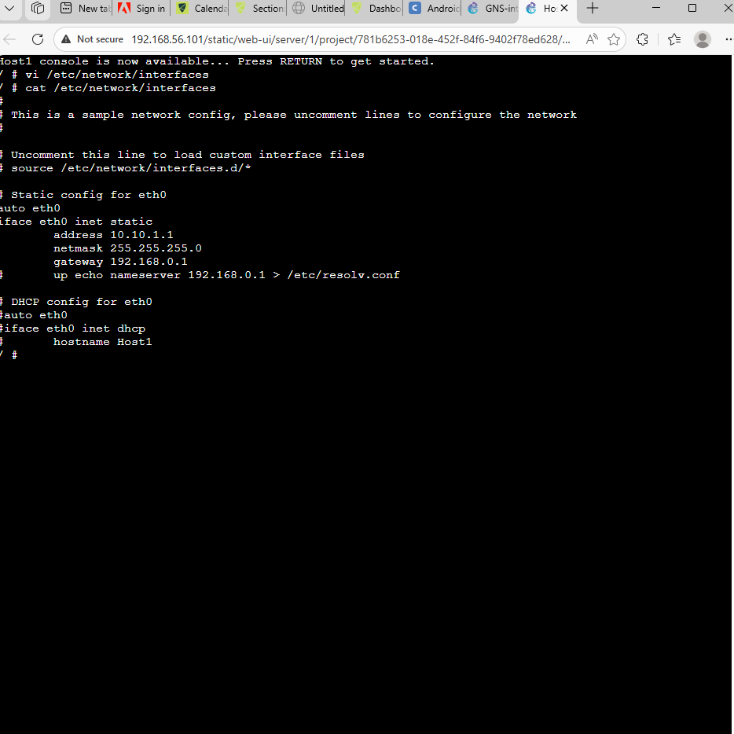
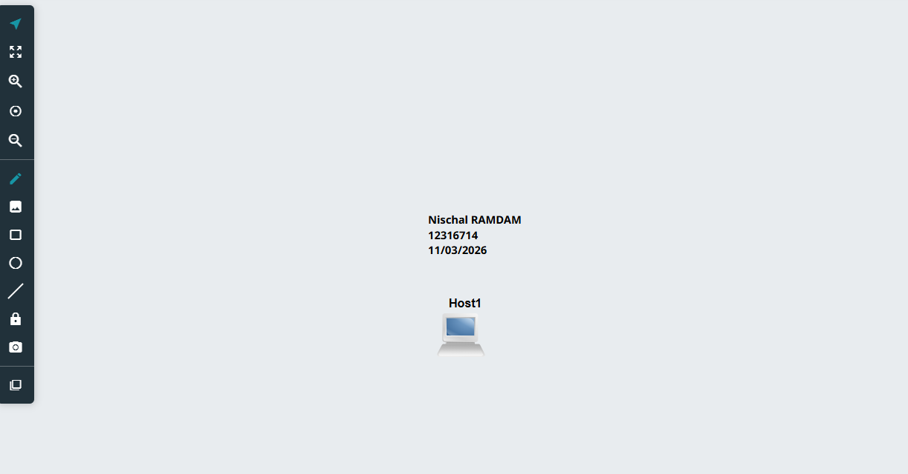

# TCP/IP Configuration - Week 1

## Student Details
- Name: Nischal Ramdam  
- Student ID: 12316714  
- Course: COIT12206  
- Date: 11/03/2026  

---

## Project Overview
This project demonstrates a basic TCP/IP configuration using GNS3. A single host (Host1) is configured with a static IP address and verified using console commands.

---

## Network Topology
- 1 Host (Host1)  
- No switch (basic standalone configuration)

---

## IP Configuration

- IP Address: 10.10.1.1  
- Subnet Mask: 255.255.255.0  
- Gateway: 192.168.0.1  
- DNS: 192.168.0.1  

---

## Configuration Code

```bash
auto eth0
iface eth0 inet static
    address 10.10.1.1
    netmask 255.255.255.0
    gateway 192.168.0.1
    up echo nameserver 192.168.0.1 > /etc/resolv.conf
```

---

## Screenshots

### Project Creation


### Host Configuration


### Console Output


### Topology View


