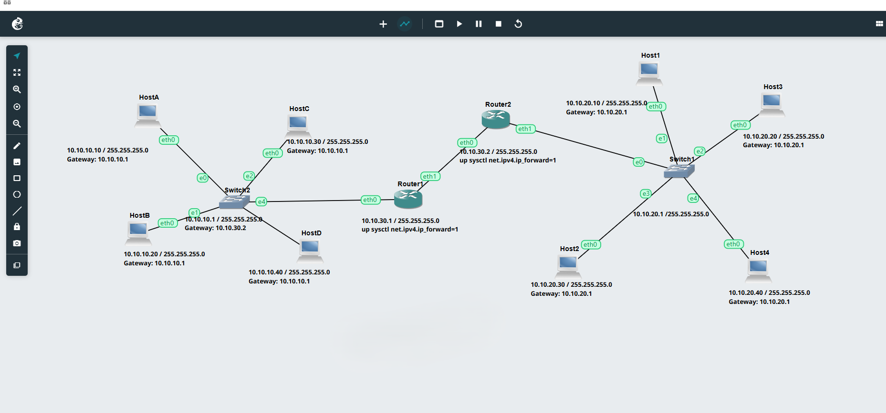
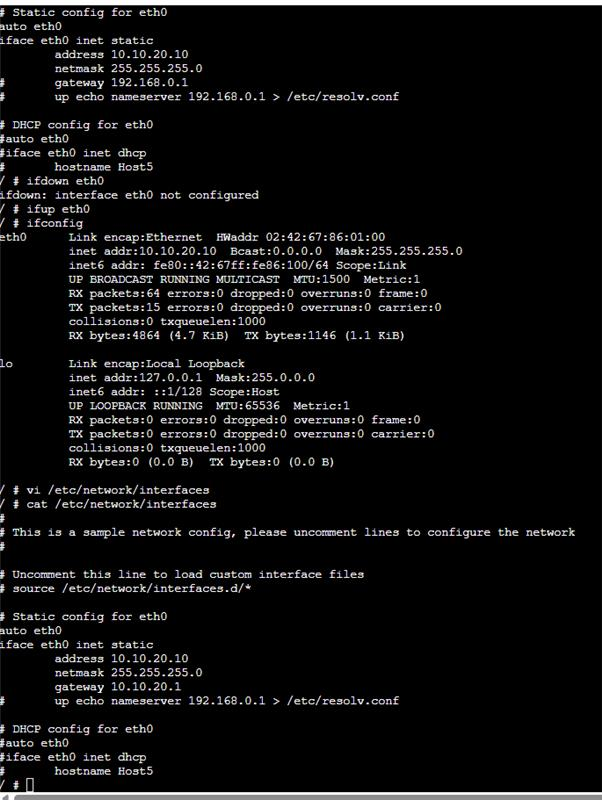
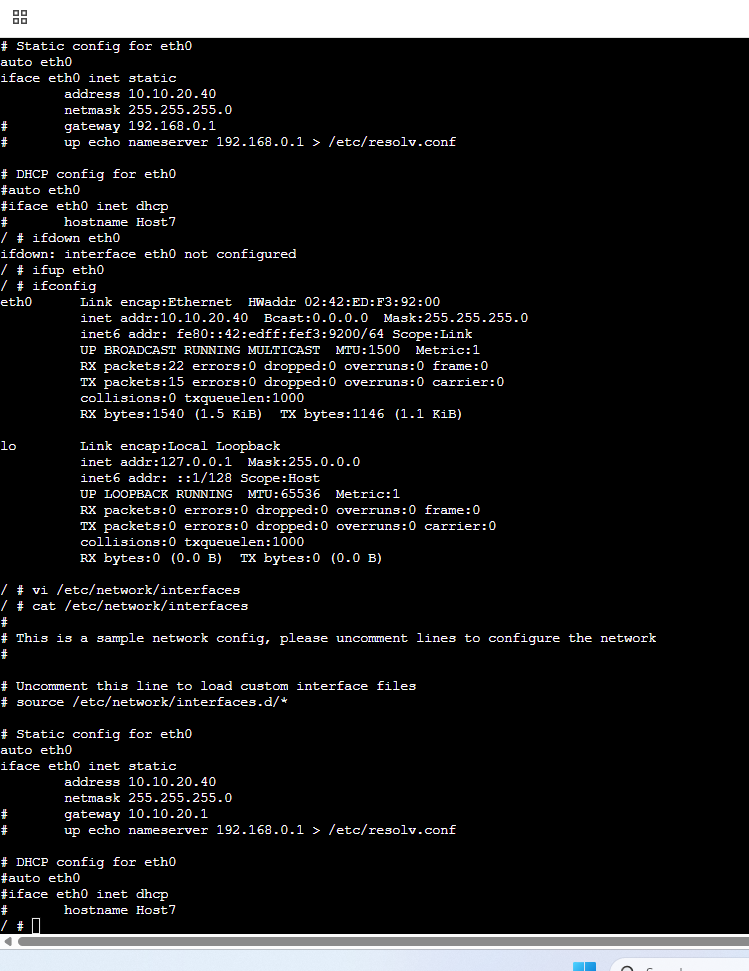

# Week 6 – Address Resolution and Management
Student Details

Name: Nischal Ramdam

Student ID: 12316714

Date: 01/04/2026

## Overview

In this week, I learned about how ARP works and how devices find each other in a network. The main focus was on setting up hosts and routers, checking their configurations, and testing whether devices could communicate properly using commands like ping and ARP.

---

## Topology

This network has two LANs connected using two routers. On the left side, there are HostA, HostB, HostC, and HostD. On the right side, there are Host1, Host2, Host3, and Host4.

---

## Left LAN Host Configuration

### HostA

HostA was given a static IP address in the network 10.10.10.0/24. It uses Router1 as its default gateway so it can communicate outside its network.

---

### HostB

HostB is also in the same network as HostA but has a different IP address.

---

### HostC

HostC was configured similarly, using the same subnet and gateway.

---

### HostD

HostD is also part of the same LAN and follows the same configuration.

---

## Right LAN Host Configuration

### Host1

Host1 is in a different network, which is 10.10.20.0/24.

---

### Host2

Host2 is also in the same network as Host1 but with a different IP.

---

### Host3

Host3 uses Router2 as its default gateway to communicate with other networks.

---

### Host4

Host4 is configured in the same way and was checked using interface commands.

---

## Router Configuration

### Router1

Router1 connects the left LAN to the middle network. IP forwarding was enabled so it can send packets between networks.

This shows that the interfaces were set correctly.

---

### Router2

Router2 connects the middle network to the right LAN. It also has IP forwarding enabled.

This confirms the router interfaces are working properly.

---

## Testing and Verification

Different commands were used to check the network:

* `ifconfig` → to check IP addresses
* `ping` → to test communication
* `arp -a` → to check ARP table

When I used ping, devices were able to communicate if everything was configured correctly.

ARP was used in the background. When a device sends data, it first needs the MAC address of the destination. So it sends an ARP request to find it, and the correct device replies back with its MAC address.

---

## Result

In this task, all devices were configured with proper IP addresses, and routers were able to forward packets between networks. The ping tests showed that communication was working, and ARP helped in resolving IP addresses to MAC addresses within the network.

